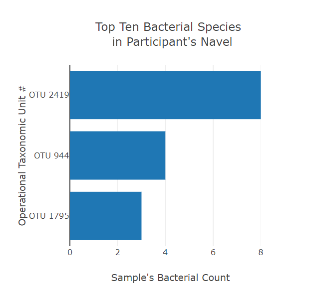
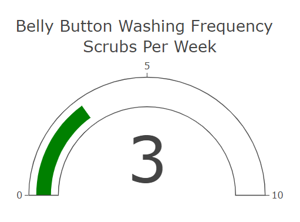
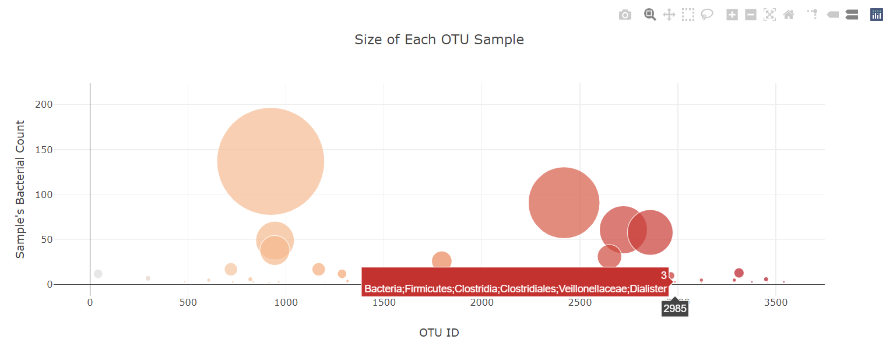

# BacteriaBiodiversity
Plotly graphs of JSON data
A scientific investigation into plausibility of finding the right bacteria
to synthesize proteins that taste like beef. The right bacteria may exist in 
someone's belly button. This study collected belly button bacteria and other data from participants including:

- participant id
- ethnicity
- gender
- city/state
- belly button type
- wash frequency

## Screenshots from the Bacteria Portfolio
When the participant's id is chosen from the drop-down menu,
three charts are diplayed. 

## Resources
### Data Source:
samples.js - JSON file with a data object in the form:
 {
 "names":[
  "940", .....],
 "metadata": [{
  "id":940, 
  "ethnicity: "Caucasian",
  "gender": "F",
  "age": 24.0,
  "location": "Beauford/NC"
  "bbtype": "I",
  "wfreq": 2.0}.......],
 "samples":[{
   "id":"940",
   "otu_ids": [1167,2859,.....],
   "sample_values": [163,126,...],
   "otu_labels": ["Bacteria;Bacteriodetes;....."]....
 }

plots.js - This is the JavaScript program that filters the data and creates the charts to present on the webpage.

index.html - to render the webpage.
 
### Software:

- JavaScript
- Data-Driven Documents (D3) JavaScript library
- Bootstrap
- HTML
- css
- VS Code
